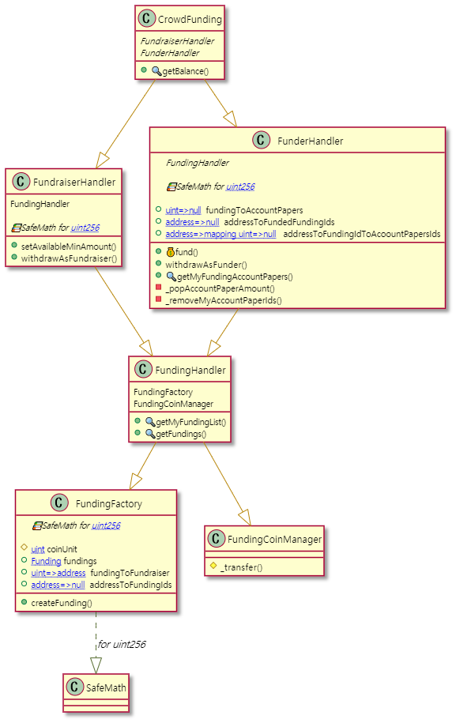

# crowd-funding

This is a program that is crowdfunding which is able to operate in Ethereum network. There are two type  of users in this contract, The first one is a `Funder` who fund for funding success. The second one is a `Fundraiser` who create a funding for his project.

When `Fundraiser` create a funding, he needs to set up title, subtitle, content, goalAmount, minAvailableAmount, beginTime, endTime about his funding.

In order to withdraw Ether from a funding as `Fundraiser`, You need a successful funding that stored in this smart contract.

In order to withdraw Ether from a funding as `Funder`, A funding state must be failed or progress.

> getBalance method that is located in crowdFunding would show you balance of this contract.

## Publish

* [Ropsten Test Network](https://ropsten.etherscan.io/address/0x70Bf3Fffa538Ec8c7Da3AADf81Fdc0B67093590F)

## Contracts UML

## Contracts Description Table

|  Contract  |         Type        |       Bases      |                  |                 |
|:----------:|:-------------------:|:----------------:|:----------------:|:---------------:|
|          |  **Function Name**  |  **Visibility**  |  **Mutability**  |  **Modifiers**  |
| **CrowdFunding** | ***Implementation*** | FundraiserHandler, FunderHandler |||
| L  | getBalance | Public ❗️  |   |NO❗️ |
| **FundraiserHandler** | ******Implementation****** | FundingHandler |||
|  L | setAvailableMinAmount | External ❗️ | 🛑  | ownerOfFunding |
|  L | withdrawAsFundraiser | External ❗️ | 🛑  | fundingSucceeded |
| **FundingHandler** | ***Implementation*** | FundingFactory, FundingCoinManager |||
 | L  | getMyFundingList | External ❗️  |   |NO❗️ |
 | L  | getFundings | External ❗️  |  |NO❗️ |
| **FundingFactory** | ***Implementation*** |  |||
 | L  | createFunding | External ❗️ | 🛑  |NO❗️ |
| **FundingCoinManager** | ***Implementation*** |  |||
 | L  | _transfer | Internal 🔒 | 🛑  | |
| **FunderHandler** | ***Implementation*** | FundingHandler |||
| L  | fund | External ❗️ |  💵 | availableFund |
| L  | withdrawAsFunder | External ❗️ | 🛑  | funded fundingNotEndOrFailed |
| L  | getMyFundingAccountPapers | External ❗️  |  |NO❗️ |
| L  | _popAccountPaperAmount | Private 🔐 | 🛑  | |
| L  | _removeMyAccountPaperIds | Private 🔐 | 🛑  | |

### Legend

|  Symbol  |  Meaning  |
|:--------:|-----------|
|    🛑    | Function can modify state |
|    💵    | Function is payable |
