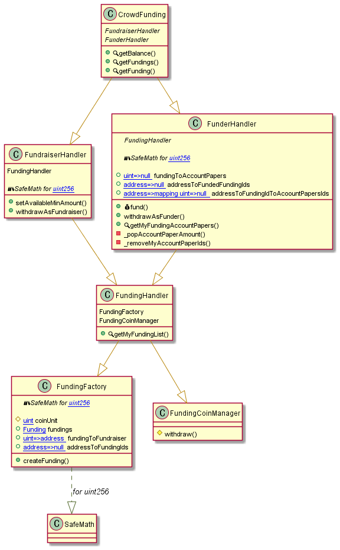

# crowd-funding

This is a program that is crowdfunding which is able to operate in Ethereum network. There are two type  of users in this contract, The first one is a `Funder` who fund for funding success. The second one is a `Fundraiser` who create a funding for his project.

When `Fundraiser` create a funding, he needs to set up title, subtitle, content, goalAmount, minAvailableAmount, beginTime, endTime about his funding.

In order to withdraw Ether from a funding as `Fundraiser`, You need a successful funding that stored in this smart contract.

In order to withdraw Ether from a funding as `Funder`, A funding state must be failed or progress.

* The `getBalance` method that is located in crowdFunding would show you balance of this contract.
* All of Coin unit is wei.

## Requirement

* `node >7.x.x && <17.x.x`
* `truffle ^5.5.x (If you want to test on private network or deploy contract.)`

## Usage

1. Make `.secret` file on root directory and put the mnemonic that you set up when you created the Ethereum account in `.secret `file.
    * If you don't have an Ethereum account, [create it here](https://metamask.io/).
2. Change `RPC URL` in `/truffle-config.js` to yours. The location is ropsten provider under the network.
3. Change account value to yours in `/js/CrowdFunding.js`.
4. Refer To the  API List below and modify the `/app.js` for What you want to do.

|Method|Params|Description|
|---|:---:|---|
| getFunding | id | Return funding that is `id` that you put funding in contract. |
| getFundings | | Return all of Fundings in contract. |
| createFunding | title, subTitle, content, goalAmount, availableMinAmount, beginTime, endTime | |
| fund | id, amount |  |
| getMyFundingAccountPapers | id | This method would return receipts that you funded at `id`. |
| withdrawAsFunder | id | This method possible  you to get a refund from funding that you funded. |
| withdrawAsFundraiser | id | When funding finished successfully, You can withdraw from funding that you made. |
| setAvailableMinAmount | id, amount | This method change funding 'available min amount'. |

## Test Publish
|Network|Contract|Txn Hash|Block|
|---|---|---|---|
|[Ropsten](https://ropsten.etherscan.io/address/0xA0A5B8867D21BD4d7fA8119c84D8CB36a84e45f2)|0xA0A5B8867D21BD4d7fA8119c84D8CB36a84e45f2|[0xdfe79ac00610feb29dc25aa516e91da1f1146244cdd5b2ad71cfcad24235cad3](https://ropsten.etherscan.io/tx/0xdfe79ac00610feb29dc25aa516e91da1f1146244cdd5b2ad71cfcad24235cad3)|[12042051](https://ropsten.etherscan.io/block/12042051)|

## Contracts UML

## Contracts Description Table

|  Contract  |         Type        |       Bases      |                  |                 |
|:----------:|:-------------------:|:----------------:|:----------------:|:---------------:|
|          |  **Function Name**  |  **Visibility**  |  **Mutability**  |  **Modifiers**  |
| **CrowdFunding** | ***Implementation*** | FundraiserHandler, FunderHandler |||
| L  | getBalance | Public ❗️  |   |NO❗️ |
| **FundraiserHandler** | ******Implementation****** | FundingHandler |||
|  L | setAvailableMinAmount | External ❗️ | 🛑  | ownerOfFunding |
|  L | withdrawAsFundraiser | External ❗️ | 🛑  | fundingSucceeded |
| **FundingHandler** | ***Implementation*** | FundingFactory, FundingCoinManager |||
 | L  | getMyFundingList | External ❗️  |   |NO❗️ |
 | L  | getFundings | External ❗️  |  |NO❗️ |
| **FundingFactory** | ***Implementation*** |  |||
 | L  | createFunding | External ❗️ | 🛑  |NO❗️ |
| **FundingCoinManager** | ***Implementation*** |  |||
 | L  | _transfer | Internal 🔒 | 🛑  | |
| **FunderHandler** | ***Implementation*** | FundingHandler |||
| L  | fund | External ❗️ |  💵 | availableFund |
| L  | withdrawAsFunder | External ❗️ | 🛑  | funded fundingNotEndOrFailed |
| L  | getMyFundingAccountPapers | External ❗️  |  |NO❗️ |
| L  | _popAccountPaperAmount | Private 🔐 | 🛑  | |
| L  | _removeMyAccountPaperIds | Private 🔐 | 🛑  | |

### Legend

|  Symbol  |  Meaning  |
|:--------:|-----------|
|    🛑    | Function can modify state |
|    💵    | Function is payable |
